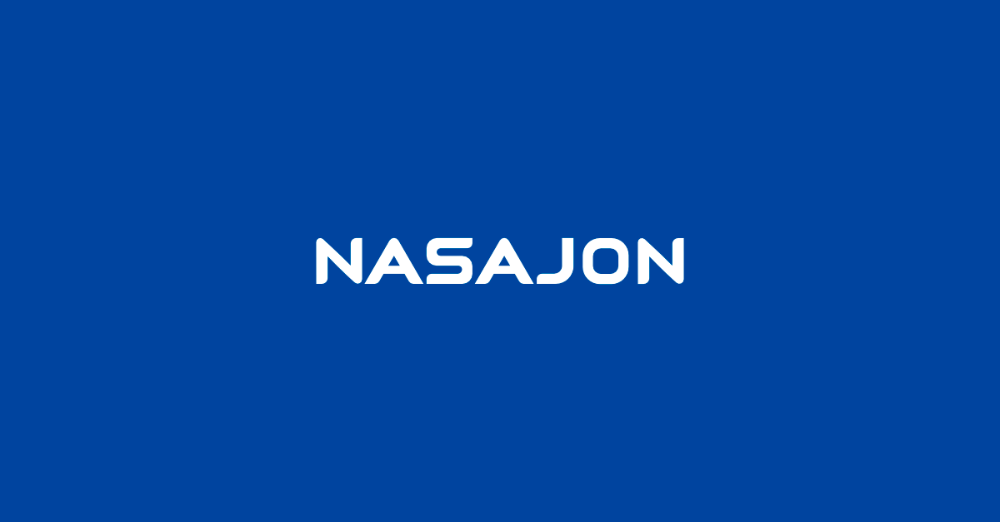

## E aí, Sou o Gesser Leal 🤟

 

## Onde me encontrar

 

## Tecnologias

  
  
  
  
  
  
  
  
  
  
  
   

 

## Sobre mim

Graduado em ciência da computação, buscando sempre aperfeiçoamento na área de TI e design gráfico de modo a aprimorar meus conhecimentos de desenvolvedor.

## Cargo atual

Desenvolvedor Front-end Junior na Empresa Nasajon. Sou direcionado a desenvolver telas recebidas pelo design e documentadas pelo PO da empresa, a fim de construir um cenário de acordo com as especificações da tela. Priorizo utilizar estilizações responsivas.

 

 
